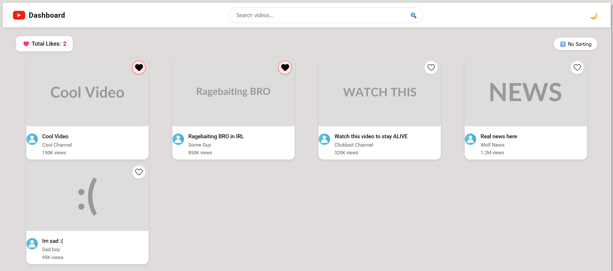

# Youtube Dashboard
An interactive web application on Vue 3 (Composition API) that displays a list of videos
## Requirements

* ✅ **Use Vue 3 with Composition API.**
* ✅ **Create at least two components: `App.vue` and `VideoCard.vue`.**
* ✅ **Use directives:** `v-if`, `v-for`, `v-bind`, `v-on`, `v-model`.
* ✅ **Include a composable file `useVideos.js`.**

### Optional
* ✅ Implement Light/Dark theme toggle  
* ✅ Add a 'Sort by Views' button  
* ✅ Show a 'Loading videos…' state before data appears  

## Used in this project
* [Placehold](https://placehold.co/) for video thumbnails

## Images

